# Ayni Aula: flujo maestro de toda la aplicación

**Versión comprobada:** checkout `codex/qa-planning-ux`, commit `db85cad` (30-09-2026). El remoto de esa rama apunta al mismo SHA. El despliegue de producción de Vercel `393FYPXti` (30-09-2026, 18:27, hora de Lima) muestra en sus fuentes el cambio `.local` de ese commit. Como se publicó por CLI sin Git conectado, Vercel no expone un SHA de despliegue para probar igualdad byte a byte; el mapa toma como autoridad la última versión verificable de la rama y distingue las rutas sujetas a flags. Se puede abrir este `.md` en un visor de Mermaid y ampliar el gráfico como un tablero de n8n.

**Leyenda:** azul = entrada o decisión **manual**; violeta = **llamada a IA**; gris = proceso del **servidor/código**; verde = **dato guardado**; amarillo = **salida**. Una flecha continua transporta datos o la confirmación necesaria para continuar. Una flecha punteada aporta conocimiento, prompt o métricas. Cada `AIxx` identifica una llamada posible y cada `Mxx` señala dónde interviene una persona.

## Diagrama único

```mermaid
flowchart TB
  subgraph ACC["0 · CUENTA Y CONFIGURACIÓN"]
    direction LR
    M01["M01 · ADMIN MANUAL<br/>Crear o reiniciar cuenta"]:::manual --> S01["S01 · SERVIDOR<br/>DNI, rol y sesión"]:::system
    M02["M02 · DOCENTE MANUAL<br/>DNI + contraseña"]:::manual --> S01
    S01 --> D01[("D01 · Supabase Auth<br/>PostgreSQL y RLS")]:::data
    D01 --> M03["M03 · DOCENTE MANUAL<br/>Perfil, aula y estudiantes"]:::manual
    M03 --> D02[("D02 · Aula, edad<br/>contexto y matrícula")]:::data
    M04["M04 · DOCENTE MANUAL<br/>Calendario y excepciones"]:::manual --> D03[("D03 · Días lectivos<br/>y períodos")]:::data
  end

  subgraph DIA["1 · DIAGNÓSTICO DENTRO DE PLANIFICAR"]
    direction LR
    M05["M05 · MANUAL<br/>Entrevista familiar"]:::manual --> D04[("D04 · Fuentes<br/>diagnósticas")]:::data
    M06["M06 · MANUAL<br/>Experiencias y observaciones guiadas"]:::manual --> D04
    M07["M07 · MANUAL<br/>Observación espontánea<br/>texto y adjunto privado"]:::manual --> D04
    M07 --> AI01["AI01 · JEV 1.13*<br/>Sugerir competencia"]:::optional
    AI01 --> M08["M08 · MANUAL<br/>Aceptar, cambiar o descartar"]:::manual
    M08 --> D04
    D04 --> S02["S02 · CÓDIGO<br/>Proyección con alias<br/>sin archivos"]:::system
    S02 --> AI02["AI02 · SOL medio<br/>Resumen del grupo"]:::ai
    AI02 --> M09["M09 · MANUAL<br/>Editar y confirmar resumen"]:::manual
    M09 --> D05[("D05 · Diagnóstico<br/>grupal confirmado")]:::data
    D05 --> AI03["AI03 · SOL medio<br/>Prioridades del año"]:::ai
    AI03 --> M10["M10 · MANUAL<br/>Confirmar prioridades"]:::manual
    M10 --> D06[("D06 · Prioridades<br/>confirmadas")]:::data
  end

  subgraph ANO["2 · MI AÑO / PLAN MAESTRO"]
    direction LR
    D05 --> S03["S03 · CÓDIGO<br/>Contexto sin nombres<br/>+ 12 espacios lectivos"]:::system
    D06 --> S03
    D03 --> S03
    S03 --> AI04["AI04 · SOL alto<br/>Proponer 12 proyectos/unidades"]:::ai
    AI04 --> S04["S04 · CÓDIGO<br/>Validar IDs, fechas<br/>y esquema"]:::system
    S04 --> M11["M11 · MANUAL<br/>Editar y confirmar Mi año"]:::manual
    M11 --> D07[("D07 · Plan anual<br/>versionado")]:::data
    D07 --> AI05["AI05 · SOL bajo<br/>Redacción formal"]:::ai
    AI05 --> S05["S05 · CÓDIGO<br/>Armar Word anual"]:::system
    S05 --> O01(["O01 · Word del plan"]):::output
  end

  subgraph PRO["3 · PROYECTO O UNIDAD"]
    direction LR
    D07 --> M12["M12 · MANUAL<br/>Elegir propuesta del plan"]:::manual
    M12 --> AI07["AI07 · SOL medio<br/>Vista previa y propósitos"]:::ai
    M13["M13 · MANUAL<br/>Interés nuevo del grupo*"]:::manual --> AI06["AI06 · SOL medio*<br/>Propuesta emergente"]:::optional
    AI06 --> M13B["M13B · MANUAL<br/>Revisar e incorporar al plan"]:::manual
    M13B --> M12
    AI07 --> M14["M14 · MANUAL<br/>Contexto, propósito<br/>y competencias"]:::manual
    M14 --> AI08["AI08 · SOL medio<br/>Preguntas, recorrido<br/>y criterios"]:::ai
    AI08 --> M15["M15 · MANUAL<br/>Revisar dependencias"]:::manual
    M15 --> AI09["AI09 · SOL medio<br/>Proyecto Master<br/>mapa por fecha"]:::ai
    AI09 --> M16["M16 · MANUAL<br/>Editar y confirmar mapa"]:::manual
    M16 --> D08[("D08 · Proyecto/unidad<br/>confirmado")]:::data
    D08 --> AI10["AI10 · SOL medio<br/>Texto formal"]:::ai
    AI10 --> S05B["S05B · CÓDIGO<br/>Armar Word del proyecto"]:::system
    S05B --> O02(["O02 · Word del proyecto"]):::output
  end

  subgraph PREP["4 · ACTIVIDADES, TALLERES Y BIBLIOTECA"]
    direction LR
    D08 --> AI11["AI11 · LUNA medio<br/>Actividad del día"]:::ai
    AI11 --> M17["M17 · MANUAL<br/>Revisar y confirmar actividad"]:::manual
    M17 --> D09[("D09 · Actividad<br/>y criterios")]:::data
    D08 --> AI12["AI12 · SOL medio<br/>Maestro de talleres"]:::ai
    AI12 --> S06["S06 · CÓDIGO / JEV*<br/>Sugerir ficha de Biblioteca"]:::system
    S06 --> M18["M18 · MANUAL<br/>Elegir taller y ficha"]:::manual
    M18 --> AI13["AI13 · LUNA medio<br/>Taller del día"]:::ai
    AI13 --> M19["M19 · MANUAL<br/>Confirmar taller"]:::manual
    M19 --> D10[("D10 · Taller<br/>confirmado")]:::data
  end

  subgraph HOY["5 · HOY, ASISTENCIA Y EVIDENCIAS"]
    direction LR
    D09 --> S07["S07 · CÓDIGO<br/>Jornada y agenda"]:::system
    D10 --> S07
    D03 --> S07
    S07 --> M20["M20 · MANUAL<br/>Hoy / Mi aula: asistencia<br/>y evidencia"]:::manual
    M20 --> D11[("D11 · Evidencia descriptiva<br/>y adjunto privado")]:::data
    M20 --> AI14["AI14 · TRANSCRIBE*<br/>Audio autorizado a texto"]:::optional
    AI14 --> M20
  end

  subgraph EVA["6 · EVALUAR Y CERRAR PERÍODO"]
    direction LR
    D11 --> AI15["AI15 · SOL medio<br/>Assessment Master"]:::ai
    AI15 --> M21["M21 · MANUAL<br/>Confirmar marco"]:::manual
    M21 --> AI16["AI16 · LUNA medio<br/>Analizar evidencias<br/>sin poner nivel"]:::ai
    D11 --> AI16
    AI16 --> M22["M22 · MANUAL<br/>Revisar hallazgos<br/>y decidir AD/A/B/C"]:::manual
    M22 --> AI17["AI17 · LUNA medio<br/>Conclusión descriptiva"]:::ai
    D11 --> AI17
    AI17 --> M23["M23 · MANUAL<br/>Confirmar conclusión"]:::manual
    M23 --> D12[("D12 · Evaluación<br/>confirmada")]:::data
    D12 --> S08["S08 · CÓDIGO<br/>Consolidado y cierre"]:::system
    S08 --> O03(["O03 · Vista + CSV/XLSX"]):::output
    D12 --> AI18["AI18 · LUNA medio<br/>Informe familiar"]:::ai
    AI18 --> M24["M24 · MANUAL<br/>Confirmar informe"]:::manual
    M24 --> O06(["O06 · Informe familiar"]):::output
    D12 --> AI19["AI19 · SOL medio<br/>Informe del aula"]:::ai
    AI19 --> M25["M25 · MANUAL<br/>Confirmar informe"]:::manual
    M25 --> O07(["O07 · Informe del aula"]):::output
    S08 --> S09["S09 · CÓDIGO<br/>Balance y nueva versión<br/>del plan siguiente"]:::system
    S09 --> M11
  end

  subgraph TRANS["7 · CONOCIMIENTO, DOCUMENTOS Y COSTO (TRANSVERSAL)"]
    direction LR
    K01[("K01 · CNEB oficial<br/>IDs, edades, competencias")]:::data
    K02[("K02 · KB didáctica v4.1<br/>selección por flujo")]:::data
    K03[("K03 · Skills y prompts<br/>por tarea")]:::data
    D05 --> S10["S10 · CÓDIGO<br/>Documento desde versiones"]:::system
    D07 --> S10
    D08 --> S10
    D09 --> S10
    D12 --> S10
    S10 --> O04(["O04 · Documentos Word<br/>y descargas privadas"]):::output
    S11["S11 · CÓDIGO<br/>Medición de llamadas IA"]:::system --> D13[("D13 · Modelo, tokens<br/>y costo estimado")]:::data
    D13 --> O05(["O05 · Panel admin<br/>gasto por cuenta"]):::output
  end

  D02 --> D04
  D02 --> S03
  D03 --> AI09
  D08 --> AI12
  K01 -. "competencias aplicables" .-> AI01
  K01 -. "tarjetas oficiales" .-> AI02
  K01 -. "tarjetas oficiales" .-> AI04
  K01 -. "currículo" .-> AI15
  K02 -. "didáctica focalizada" .-> AI04
  K02 -. "didáctica focalizada" .-> AI07
  K02 -. "didáctica focalizada" .-> AI11
  K02 -. "didáctica focalizada" .-> AI12
  K02 -. "contexto de evaluación" .-> AI16
  K03 -. "prompt diagnóstico" .-> AI02
  K03 -. "skill anual" .-> AI04
  K03 -. "skill proyecto" .-> AI07
  K03 -. "skill actividad" .-> AI11
  AI02 -. "uso" .-> S11
  AI04 -. "uso" .-> S11
  AI11 -. "uso" .-> S11
  AI16 -. "uso" .-> S11

  classDef manual fill:#d7effa,stroke:#087d96,color:#10354a,stroke-width:2px
  classDef ai fill:#e8dcff,stroke:#7046b5,color:#2d2143,stroke-width:2px
  classDef optional fill:#f0e8ff,stroke:#7046b5,color:#2d2143,stroke-width:2px,stroke-dasharray:5 3
  classDef system fill:#eef1f5,stroke:#718092,color:#243343,stroke-width:1.5px
  classDef data fill:#dff3e7,stroke:#3e8b61,color:#173e2c,stroke-width:1.5px
  classDef output fill:#fff0cc,stroke:#b47714,color:#493307,stroke-width:2px
```

### Cómo interpretar el tablero

- El diagrama se lee de **arriba hacia abajo**. Cada banda numerada corresponde a un área del producto; dentro de ella las flechas avanzan de izquierda a derecha.
- `Mxx` siempre significa **dato escrito, selección o confirmación humana**. `AIxx` es una posible petición facturable a un proveedor. `Sxx` es código determinista. `Dxx` es estado persistido; `Oxx` es algo visible o descargable.
- Los enlaces punteados desde `K01`/`K02`/`K03` son **fragmentos seleccionados para el prompt**, no llamadas a otra IA. El cuadro transversal de costos representa el registro de uso; las cuatro flechas punteadas son ejemplos visuales y no una lista exhaustiva de llamadas medidas.
- La fotografía o grabación se almacena de forma privada. Las rutas de diagnóstico grupal y evaluación no envían esos archivos al modelo. La **observación espontánea V2.4** es distinta: si el flag está activo, entrega a Jev el texto original de esa nota, sin el adjunto.
- El diagrama condensa versiones, validadores y rutas de compatibilidad para que se pueda seguir el recorrido; abajo se detallan entradas, salidas y límites de cada tramo.

## El mismo flujo, explicado con palabras

### 0. Cuenta, perfil y calendario

1. **Administrador (`M01`)** crea la cuenta docente por DNI y contraseña, o reinicia la contraseña. **Docente (`M02`)** inicia sesión. El servidor (`S01`) valida identidad y rol con Supabase Auth; en cada petición comprueba el acceso al aula y PostgreSQL aplica RLS. La sesión docente se renueva por actividad hasta 30 días de inactividad. No hay IA en este tramo.
2. La docente registra **institución, año, sección, edad, estudiantes y contexto** (`M03 → D02`). Configura bloques lectivos, excepciones y feriados (`M04 → D03`). Estos datos son entradas para diagnóstico, Mi año, fechas de proyecto y agenda de Hoy.

### 1. Diagnóstico

3. La docente guarda entrevistas familiares (`M05`), observaciones de experiencias guiadas (`M06`) y notas espontáneas (`M07`). La entrevista es **contexto**, no una evaluación observada. Todos esos registros quedan vinculados al aula (`D04`). Fotos y audios, si existen, van a Storage privado.
4. **Jev opcional (`AI01`)** recibe texto original de una observación espontánea, edad, aplicabilidad, KB CNEB y prompt V2.4 congelado. Devuelve una sugerencia de competencia; la docente la acepta, cambia o descarta (`M08`). Con `AYNI_OBSERVATION_CLASSIFIER_V24` apagado se clasifica manualmente. No se envía el archivo adjunto a Jev.
5. El servidor prepara una **proyección anónima** (`S02`) de notas recientes y comentarios individuales ya confirmados. **Sol medio (`AI02`)** recibe esa proyección, edad, cantidad de niños, tarjetas CNEB aplicables y skill diagnóstico; propone fortalezas, necesidades y orientaciones de planificación. No recibe la entrevista familiar completa, nombres ni archivos. La docente edita y confirma el resumen (`M09 → D05`). La sugerencia individual por IA existe en código, pero la ruta actual la rechaza: el comentario individual lo escribe o dicta la profesora.
6. **Sol medio (`AI03`)** recibe el resumen grupal confirmado y competencias aplicables; sugiere prioridades editables. La docente confirma (`M10 → D06`). Sin resumen y prioridades confirmados no se inicia el preplan nuevo.

### 2. Mi año

7. El servidor junta diagnóstico confirmado, prioridades, intereses, contexto y calendario. Calcula **12 espacios lectivos** (`S03`). **Sol alto (`AI04`)** recibe eso, tarjetas oficiales CNEB, KB didáctica v4.1 focalizada y skill anual. Devuelve exactamente 12 propuestas iniciales: proyecto/unidad, título, período, duración, propósito y competencias. No crea actividades ni evidencias reales. El código valida IDs y fechas (`S04`). La profesora edita y confirma (`M11 → D07`).
8. Después, **Sol bajo (`AI05`)** redacta el contenido formal a partir del plan confirmado, diagnóstico, currículo y estructura de plantilla. El código arma el Word (`S05 → O01`). La exportación del archivo en sí no es otra llamada de IA.

### 3. Proyecto o unidad

9. La docente elige una propuesta del plan (`M12`), o describe un nuevo interés del grupo (`M13`). En el segundo caso, **Sol medio (`AI06`)** sugiere una nueva fila anual; la docente debe incorporarla y confirmarla antes de continuar. Con la propuesta elegida, **Sol medio (`AI07`)** prepara contexto y opciones de propósito.
10. La profesora fija **contexto, propósito y competencias** (`M14`). **Sol medio (`AI08`)** produce preguntas guía, recorrido y criterios generales; la docente los revisa (`M15`). **Sol medio (`AI09`)** produce el Proyecto Master, con una fila de actividad por fecha lectiva confirmada. La profesora revisa/edita ese mapa (`M16 → D08`). Las llamadas usan CNEB, KB focalizada y skill de proyecto/unidad.
11. **Sol medio (`AI10`)** desarrolla el texto formal del proyecto confirmado y el código compone su Word (`O02`). Las decisiones confirmadas no se sustituyen por la redacción del documento.

### 4. Actividad, taller y Biblioteca

12. **Luna medio (`AI11`)** recibe la fila del mapa confirmado, fecha, propósito, competencia, criterio, evidencia prevista, continuidad y contexto, más KB y skill de actividad. Devuelve la actividad cotidiana editable. Si hay un fallo de calidad o validación, puede haber **un** reintento con Sol bajo. La docente confirma (`M17 → D09`).
13. **Sol medio (`AI12`)** recibe proyecto confirmado, mapa, cobertura de competencias, prioridades y materiales; propone el maestro de talleres por día. **Solo después** de elegir la intención se sugieren fichas del catálogo (`S06`), con Jev si su flag propio está activo. La docente elige taller/ficha (`M18`). **Luna medio (`AI13`)** recibe el maestro, ficha, actividad vinculada y continuidad; desarrolla el taller del día. La docente confirma (`M19 → D10`). Biblioteca aporta recursos existentes; la generación independiente de fichas por IA no está disponible como flujo productivo.

### 5. Hoy y evidencias

14. **Hoy (`S07`)** toma calendario, actividad y taller confirmados. La docente ejecuta, registra asistencia y captura evidencia descriptiva (`M20 → D11`). Guardar evidencia es código; no equivale a pedir interpretación a IA. Una transcripción autorizada de audio puede llamar a `gpt-4o-mini-transcribe` (`AI14`); el texto se revisa antes de usarlo.

### 6. Evaluar, informes y nuevo ciclo

15. **Sol medio (`AI15`)** prepara el Assessment Master del período con competencias trabajadas, fuentes y contexto. La docente lo confirma (`M21`). **Luna medio (`AI16`)** recibe evidencias desidentificadas, criterios, marco confirmado y antecedentes; devuelve hallazgos, patrones y vacíos **sin asignar AD/A/B/C**. Sol medio puede servir de respaldo por validación o para revisión profunda. La profesora revisa y decide el nivel (`M22`).
16. **Luna medio (`AI17`)** redacta una conclusión breve usando evidencias y valoración docente; Sol bajo es respaldo por calidad o revisión profunda. La docente confirma (`M23 → D12`). El consolidado (`S08 → O03`) muestra nivel, comentario y estado por estudiante/competencia; solo las filas confirmadas muestran letra y conclusión. Tiene CSV/XLSX genérico. La exportación específica para SIAGIE aún no está implementada.
17. Desde conclusiones confirmadas, **Luna medio (`AI18`)** propone informe familiar y la docente confirma (`M24`). Desde estadísticas y mapa de evaluación, **Sol medio (`AI19`)** propone informe del aula; también requiere confirmación (`M25`). El cierre del período y la revisión del siguiente plan (`S09`) se calculan desde el estado guardado; una nueva versión del plan vuelve a `M11`.

### 7. Documentos, conocimiento, permisos y gasto

18. **CNEB oficial (`K01`)** contiene IDs estables, competencias y referencias por edad. **KB didáctica v4.1 (`K02`)** se recupera por flujo, edad y competencias pertinentes; no se manda íntegra en cada prompt. **Skills/prompts (`K03`)** especifican tarea y formato. Cada servicio de IA prepara su propio paquete de entrada y valida el esquema de salida.
19. La pantalla **Documentos** (`S10`) lee versiones autorizadas de diagnóstico, Mi año, proyecto, actividad, taller e informes y genera descargas Word (`O04`). La sincronización de artefactos estables y ZIP depende de flags; los archivos privados se autorizan en servidor. Renderizar Word no cuesta tokens adicionales salvo las redacciones formales ya señaladas.
20. El servidor registra metadatos de las llamadas de IA (`S11 → D13`): modelo, tokens y costo estimado. El administrador consulta gasto por cuenta (`O05`). Es una **estimación de la aplicación**, no una factura definitiva del proveedor. El administrador puede crear o reiniciar cuentas, pero no ver contraseñas guardadas.

## Inventario de llamadas de IA

| Nodo | Modelo habitual | Entrada distintiva | Conocimiento / prompt | Salida; decisión pendiente |
| --- | --- | --- | --- | --- |
| `AI01` | `typesafe/jev-1.13`* | Texto original, edad, aplicabilidad | CNEB + prompt V2.4 congelado | Competencia sugerida; docente decide. |
| `AI02` | `gpt-6-sol` medio | Notas con alias y comentarios docentes confirmados | CNEB + skill diagnóstico | Resumen grupal; docente confirma. |
| `AI03` | `gpt-6-sol` medio | Resumen grupal confirmado | CNEB + skill diagnóstico | Prioridades; docente confirma. |
| `AI04` | `gpt-6-sol` alto | Diagnóstico, contexto, calendario, 12 espacios | CNEB + KB v4.1 + skill anual | Preplan de 12 filas; docente confirma. |
| `AI05` | `gpt-6-sol` bajo | Plan anual confirmado y plantilla | CNEB + skill anual | Redacción formal. |
| `AI06` | `gpt-6-sol` medio* | Nuevo interés del grupo | CNEB + KB + skill proyecto | Fila anual emergente; docente confirma. |
| `AI07`-`AI10` | `gpt-6-sol` medio | Propuesta anual, decisiones, fechas, mapa | CNEB + KB focalizada + skill proyecto | Vista previa, dependencias, master y texto formal. |
| `AI11` | `gpt-6-luna` medio | Mapa, criterio, fecha, continuidad | KB v4.1 + skill actividad | Actividad; Sol bajo como respaldo; docente confirma. |
| `AI12` | `gpt-6-sol` medio | Proyecto, mapa, cobertura y materiales | CNEB + KB focalizada | Maestro de talleres; docente elige. |
| `AI13` | `gpt-6-luna` medio | Maestro, ficha y actividad vinculada | KB focalizada | Taller del día; docente confirma. |
| `AI14` | `gpt-4o-mini-transcribe`* | Audio autorizado | Transcripción | Texto para revisar; no inventa evidencia. |
| `AI15` | `gpt-6-sol` medio | Competencias y contexto del período | CNEB/KB | Marco de evaluación; docente confirma. |
| `AI16` | `gpt-6-luna` medio | Evidencias, criterios, marco y antecedentes | CNEB/KB | Hallazgos sin nivel; Sol medio como respaldo. |
| `AI17` | `gpt-6-luna` medio | Hallazgos, nivel docente y evidencia | CNEB/KB | Conclusión; Sol bajo como respaldo. |
| `AI18` | `gpt-6-luna` medio | Conclusiones confirmadas seleccionadas | CNEB/KB | Informe familiar; docente confirma. |
| `AI19` | `gpt-6-sol` medio | Estadísticas y mapa del período | CNEB/KB | Informe del aula; docente confirma. |

## Límites de esta representación

- El mapa corresponde al **código de `db85cad`** y a la [política de routing de IA](../src/lib/ai-execution-router-v4.mjs), no a un registro de ejecución de una profesora concreta. El remoto coincide con ese SHA y la fuente del despliegue activo contiene su cambio de `.vercelignore`; al ser un despliegue CLI sin Git conectado, Vercel no informa el SHA exacto. Las variables de Vercel no se auditaron para este documento.
- Los caminos históricos de generación de plan/proyecto permanecen en el servidor por compatibilidad; el tablero muestra el recorrido guiado actual. La función de criterio/evidencia independiente y la generación de materiales por IA figuran como no disponibles en la política.
- Una evaluación observada puede seguir siendo insuficiente; ausencia de registro no significa dificultad. La IA no inventa observaciones ni decide el nivel final.
- Fuentes clave: [navegación](../src/features/dashboard/components/teacher-workspace.tsx), [API](../scripts/local-db-server.mjs), [diagnóstico](../src/lib/diagnostic-assessment-v4.mjs), [preplan](../src/lib/annual-preplan-service.mjs), [proyecto](../src/lib/project-flow-service.mjs), [actividad](../src/lib/ai-activity-ui-service.mjs), [talleres](../src/lib/workshop-master-service.mjs), [evaluación](../src/lib/assessment-v4-service.mjs), [consolidado](../scripts/period-evaluation-routes.mjs), [uso de IA](../src/lib/ai-usage-service.mjs).
