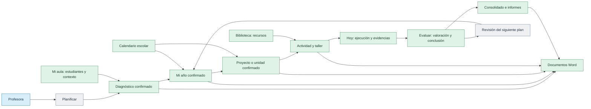
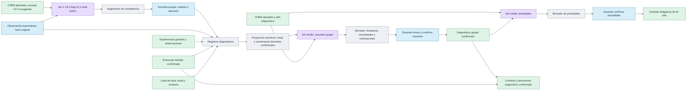
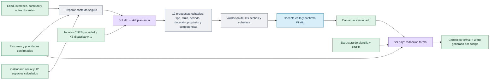
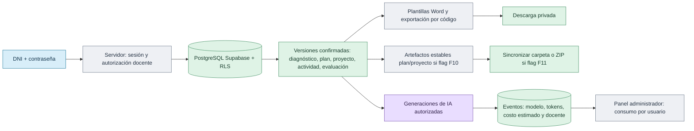

# Mapa de flujos de Ayni Aula

**Referencia:** código de `codex/qa-planning-ux`, commit `db85cad`, revisado el 30 de septiembre de 2026. Este mapa describe rutas implementadas en ese checkout. Las opciones marcadas con *flag* dependen de la configuración del entorno; el mapa no presupone que estén activadas en Vercel.

## Cómo leer los diagramas

Cada flecha representa información o una decisión que pasa al siguiente nodo. Los rectángulos azules son acciones de la profesora, los violetas son llamadas de IA, los grises son procesos de código y los verdes son datos confirmados o salidas. Una «base de conocimiento» (KB) es material local seleccionado para el prompt, no una segunda IA. Los borradores de IA nunca equivalen por sí solos a una decisión pedagógica confirmada.

En la interfaz, Diagnóstico es el primer paso de **Planificar**; también hay accesos desde Hoy y Mi aula. Los destinos visibles pueden variar con `NEXT_PUBLIC_AYNI_F7_NAV`. [Navegación](../src/features/dashboard/components/teacher-workspace.tsx) · [Decisión ADR 102](DECISIONS.md).

## 1. Diagnóstico: de registros a prioridades del año

**Límites precisos.** El resumen grupal de Sol recibe edad, cantidad de niños, observaciones recientes con alias y comentarios individuales **ya confirmados** que sigan vigentes, más tarjetas CNEB aplicables. No recibe nombres, fotos, audio ni el texto familiar completo. La entrevista sí queda en el contexto individual y en la instantánea del documento confirmado. La sugerencia Jev V2.4 recibe el texto original de la observación espontánea, edad, aplicabilidad, prompt congelado y KB; no recibe adjuntos. Esta ruta depende de `AYNI_OBSERVATION_CLASSIFIER_V24=1` y, si está apagada, la clasificación es manual. Existe código para asistencia individual con Sol, pero el endpoint productivo de sugerencia responde 422: el comentario individual lo escribe o dicta la docente. [Fuentes diagnósticas](../src/lib/diagnostic-assessment-v4.mjs) · [Síntesis grupal](../src/lib/ai-diagnostic-evaluation-service.mjs) · [Clasificador V2.4](../src/lib/observation-v24-classifier.mjs) · [ADR 098 y 100](DECISIONS.md).

## 2. Mi año: diagnóstico confirmado a plan maestro

La primera llamada propone **exactamente 12** filas; no crea actividades ni observaciones. El servidor asigna IDs y recalcula el calendario. La segunda llamada desarrolla el documento formal sin cambiar las decisiones confirmadas. El prompt combina la solicitud concreta, la skill local `crear-plan-anual`, tarjetas oficiales y una selección acotada de la KB didáctica. [Preplan](../src/lib/annual-preplan-service.mjs) · [Desarrollo formal](../src/lib/annual-formal-service.mjs) · [Selección de KB](../src/lib/ai-focused-knowledge.mjs).

## 3. Proyecto o unidad, actividades y talleres

```mermaid
flowchart LR
  A[Propuesta y fechas de Mi año]:::data --> P[Sol medio: vista previa de contexto y propósitos]:::ai
  K[CNEB + KB focalizada + skill proyecto]:::data --> P
  P --> H[Docente elige contexto, propósito y competencias]:::human
  H --> D[Sol medio: preguntas, recorrido y criterios generales]:::ai
  K --> D
  D --> R[Docente revisa decisiones]:::human
  R --> M[Sol medio: Proyecto Master y mapa por fecha lectiva]:::ai
  K --> M
  M --> X[Docente edita y confirma mapa]:::human
  X --> Y[Proyecto o unidad confirmado]:::data
  Y --> F[Sol medio: desarrollo formal]:::ai
  F --> W[Word de proyecto]:::data
  Y --> I[Luna medio: actividad del día]:::ai
  I2[Mapa confirmado, criterio, evidencia prevista, día anterior/siguiente, KB y skill actividad]:::data --> I
  I --> I3[Docente confirma actividad]:::human
  Y --> T[Sol medio: maestro de talleres]:::ai
  I2 --> T
  T --> TS[Catálogo: ficha sugerida; Jev si flag activo]:::code
  TS --> TC[Docente elige talleres y fichas]:::human
  TC --> TD[Luna medio: taller del día]:::ai
  TD --> TE[Docente confirma taller]:::human
  classDef human fill:#d8eef9,stroke:#20799c,color:#12344c
  classDef ai fill:#e9ddff,stroke:#7852ad,color:#302048
  classDef code fill:#eef0f4,stroke:#697587,color:#233041
  classDef data fill:#dff3e6,stroke:#3e8c60,color:#193d2d
```

Las cuatro llamadas de proyecto (vista previa, dependencias, mapa y texto formal) usan `gpt-6-sol` con esfuerzo medio. El mapa debe tener una actividad por fecha lectiva confirmada. La actividad cotidiana usa `gpt-6-luna` medio y puede reintentar una sola vez con Sol bajo por fallo de calidad o validación. El maestro de talleres usa Sol medio; el taller del día usa Luna medio. Las fichas se seleccionan **después** de decidir la intención pedagógica; Jev para fichas o imágenes requiere sus propios flags. También existe la ruta de **proyecto emergente**: Sol medio propone una nueva fila anual a partir del interés docente y esta se confirma antes de desarrollarse. [Flujo de proyecto](../src/lib/project-flow-service.mjs) · [Actividad](../src/lib/ai-activity-ui-service.mjs) · [Talleres](../src/lib/workshop-master-service.mjs).

## 4. Hoy, evidencias y Evaluar

```mermaid
flowchart LR
  P[Actividad y taller confirmados]:::data --> H[Hoy: ejecución, asistencia y cambios de jornada]:::code
  H --> E[Docente registra evidencia descriptiva]:::human
  E --> S[Texto y adjuntos privados en aula]:::data
  S --> M[Sol medio: Assessment Master por período]:::ai
  C[CNEB + KB y contexto del período]:::data --> M
  M --> MC[Docente confirma marco]:::human
  MC --> A[Luna medio: análisis de evidencias por niño y competencia]:::ai
  S --> A
  A --> AF[Docente revisa hallazgos y decide nivel]:::human
  AF --> Q[Luna medio: conclusión descriptiva]:::ai
  S --> Q
  Q --> QC[Docente confirma conclusión]:::human
  QC --> CO[Consolidado: nivel, comentario y estado]:::code
  CO --> FR[Luna medio: informe familiar]:::ai
  FR --> FC[Docente confirma informe]:::human
  CO --> CR[Sol medio: informe del aula por período]:::ai
  CR --> CC[Docente confirma informe del aula]:::human
  CO --> CL[Cierre del período y revisión del plan siguiente]:::code
  classDef human fill:#d8eef9,stroke:#20799c,color:#12344c
  classDef ai fill:#e9ddff,stroke:#7852ad,color:#302048
  classDef code fill:#eef0f4,stroke:#697587,color:#233041
  classDef data fill:#dff3e6,stroke:#3e8c60,color:#193d2d
```

**Lectura de evidencias.** Guardar una observación o asistencia es código, sin llamada de IA. El análisis recibe historial de evidencia y criterios, Assessment Master confirmado y, si existen, conclusiones anteriores o cambios de contexto. Los nombres conocidos se sustituyen y las imágenes/audio no se envían; solo se indica si existe un adjunto. El análisis **no asigna AD/A/B/C**. La profesora decide el nivel, y la conclusión usa hallazgos y nivel confirmados. El consolidado muestra letras y comentarios solo en filas confirmadas; puede descargarse en CSV/XLSX genérico. La exportación específica SIAGIE aún responde 501. [Evaluación](../src/lib/assessment-v4-service.mjs) · [Conclusión](../src/lib/descriptive-conclusion-v4-service.mjs) · [Consolidado y cierre](../scripts/period-evaluation-routes.mjs).

## 5. Documentos, cuenta y costos

Las claves y el modelo se resuelven en servidor. La autorización verifica la cuenta en cada petición y la propiedad de datos; los adjuntos viven en almacenamiento privado. Las llamadas se registran como eventos de uso para el panel, pero el costo calculado no sustituye la factura del proveedor. El Word se construye desde datos guardados y plantillas: **no es una llamada adicional a IA** salvo los pasos explícitos de redacción formal. [Puente de API](../app/api/%5B...path%5D/route.js) · [Servidor](../scripts/local-db-server.mjs) · [Uso de IA](../src/lib/ai-usage-service.mjs) · [Documentos](../src/lib/document-library-service.mjs).

### Módulos que aportan entradas sin generar texto con IA

| Módulo | Entrada | Salida para otros nodos |
| --- | --- | --- |
| Primer administrador y administración | Clave de configuración inicial; después, administrador autenticado | Alta, bloqueo y reinicio de cuentas docentes; consulta de eventos y costos. No permite recuperar contraseñas guardadas. |
| Perfil / Mi aula | Institución, año, sección, edad, estudiantes, entrevista y contexto | Identidad y pertenencia del aula; insumos de diagnóstico y planificación. |
| Calendario | Bloques lectivos, feriados, excepciones y fechas del año | Espacios del plan anual y fechas válidas de proyecto, actividad y taller. |
| Hoy | Jornada, actividad programada, asistencia y registro docente | Ejecución y evidencias reales para Evaluar. |
| Biblioteca | Recursos locales por edad/competencia, imágenes y fichas | Material de apoyo para elegir en actividad o taller; no sustituye el CNEB. |
| Documentos | Versiones guardadas y plantillas | Vista, Word, descargas; sincronización opcional de artefactos estables. |

Las sesiones de DNI y contraseña y la cuenta del administrador son operaciones de autenticación, no prompts. [Administración](../src/features/dashboard/components/admin-workspace.tsx) · [Aula](../src/features/dashboard/components/teacher-workspace.tsx) · [Calendario](../src/features/dashboard/components/school-calendar-screen.tsx).

## Inventario de nodos de IA

| Paso | Modelo normal | Qué entra al prompt, además de la instrucción de la tarea | Conocimiento / salida |
| --- | --- | --- | --- |
| Observación espontánea V2.4 (*flag*) | `typesafe/jev-1.13` por OpenRouter | Texto original, edad y aplicabilidad | CNEB/KB y prompt congelado → competencia sugerida; requiere decisión docente. |
| Resumen diagnóstico grupal | `gpt-6-sol`, medio | Notas recientes anonimizadas y comentarios docentes confirmados | Tarjetas CNEB + skill diagnóstico → fortalezas, necesidades, orientaciones. |
| Prioridades anuales | `gpt-6-sol`, medio | Resumen grupal confirmado y competencias aplicables | Skill diagnóstico → prioridades editables. |
| Mi año, 12 propuestas | `gpt-6-sol`, alto | Diagnóstico/prioridades confirmados, contexto, intereses, calendario y espacios calculados | CNEB + KB v4.1 focalizada + skill anual → filas editables. |
| Mi año, redacción formal | `gpt-6-sol`, bajo | Plan confirmado, diagnóstico, calendario y estructura Word | CNEB + skill anual → secciones formales. |
| Proyecto/unidad: vista previa, dependencias, mapa, formal | `gpt-6-sol`, medio | Fila anual, decisiones docentes, fechas y retroalimentación seleccionada | CNEB + KB focalizada + skill proyecto → borradores por etapa. |
| Proyecto emergente | `gpt-6-sol`, medio | Interés docente, plan y contexto del aula | CNEB + KB focalizada → nueva propuesta editable. |
| Actividad cotidiana | `gpt-6-luna`, medio; Sol bajo como respaldo | Mapa y criterio confirmados, día, contexto y continuidad | KB v4.1 + skill actividad → actividad editable. |
| Maestro de talleres | `gpt-6-sol`, medio | Proyecto/mapa confirmado, cobertura, prioridades, materiales | CNEB + KB focalizada → intención por día. |
| Taller del día | `gpt-6-luna`, medio | Maestro confirmado, actividad vinculada, ficha elegida, continuidad | KB focalizada → apertura, desarrollo, cierre. |
| Assessment Master | `gpt-6-sol`, medio | Competencias trabajadas, fuentes y contexto del período | KB/CNEB → marco por competencia. |
| Análisis por niño y competencia | `gpt-6-luna`, medio; Sol medio como respaldo | Evidencias desidentificadas, criterios, master y antecedentes | KB/CNEB → hallazgos sin nivel final. Revisión profunda: Sol medio. |
| Conclusión descriptiva | `gpt-6-luna`, medio; Sol bajo como respaldo | Hallazgos, valoración docente, evidencias y conclusión previa | KB/CNEB → texto editable. Revisión profunda: Sol bajo. |
| Informe familiar | `gpt-6-luna`, medio | Conclusiones confirmadas seleccionadas | KB/CNEB → informe para confirmar. |
| Informe del aula por período | `gpt-6-sol`, medio | Estadísticas y mapa de evaluación del período | KB/CNEB → informe grupal para confirmar. |
| Audio a texto, cuando se usa | `gpt-4o-mini-transcribe` | Audio autorizado para transcribir | Transcripción; no se infieren observaciones. |

La asignación normal y los respaldos provienen de [la política de rutas de IA](../src/lib/ai-execution-router-v4.mjs). El contexto de KB se recupera por edad, flujo y competencias aplicables; incluye unidades semánticas, referencias de fuente, reglas y tarjetas oficiales, no todos los archivos de la KB en cada solicitud. El [constructor general](../src/lib/ai-context-builder-v4.mjs) se usa en actividad y evaluación; algunos flujos de planificación usan la [selección focalizada directa](../src/lib/ai-focused-knowledge.mjs). La generación de materiales como flujo IA independiente figura como no disponible en la política: Biblioteca ofrece recursos, no un modelo generador de fichas.

## Nota de alcance

Este es un **mapa del código**, no una traza de una cuenta real. Los modelos indicados son los que selecciona la política del checkout; la llamada efectiva depende de credenciales, flags y datos confirmados. Las rutas antiguas de plan/proyecto siguen en el servidor por compatibilidad, pero los diagramas priorizan el recorrido guiado actual. Para comprobar exactamente qué nodos se ejecutaron en un caso y cuánto costaron, se necesitan los eventos de uso de IA de esa cuenta y período, sin exponer datos de menores.
